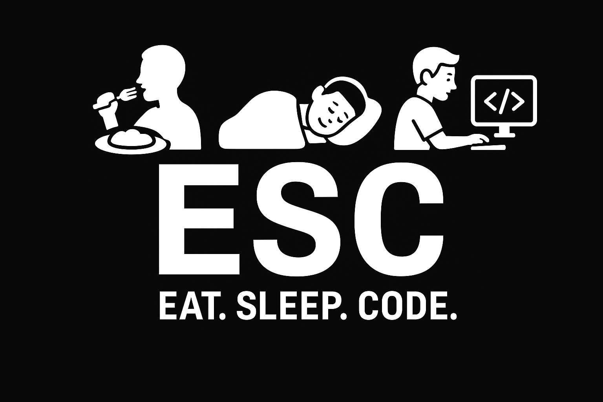

<h1 align="center">🎟️ ESC</h1>

<p align="center">
  

<h3 align="center">2팀 - 4Weekdays</h3>

<br /><br />

## 👨‍💻 팀원 구성
<table align="center">
  <tr>

[팀원 이미지]()

  </tr>

## 📘 프로젝트 기획서
<table align="center">
  <tr>

[🔗프로젝트 기획서](https://github.com/beyond-sw-camp/be17-fin-ESC-4Weekdays-BE/tree/main/docs/ESC_요구사항_정의서_4Weekdays.pdf)

## 🖥️ 시스템 아키텍쳐
<table align="center">
  

## 화면 설계서
[🔗화면 설계서(figma)](https://www.figma.com/design/3VoI4uiK22G8sYgli5Eijz/ESC_4WeekDays?node-id=0-1&t=utTqOXOI4A3VjwGC-1)


## Project Setup

```sh
npm install
```

### Compile and Hot-Reload for Development

```sh
npm run dev
```

### Compile and Minify for Production

```sh
npm run build
```